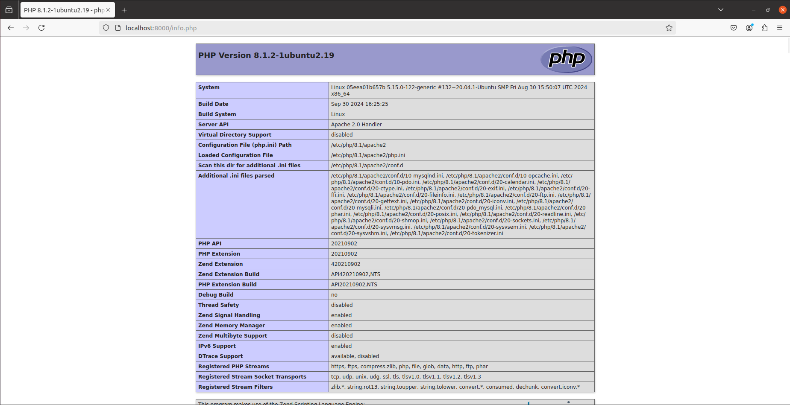

# Tarea_4-SXE

# 1. Utiliza la imagen de Ubuntu , tag 22 y apoyandote en esta guía sigue sus instrucciones para instalar LAMP en dicho contenedor.

Primero de todo creamos el contenedor de esta manera:
```bash
sudo docker run -d --name dam_lamp -p 8000:80 -it ubuntu:22.04
```
Salida:

57590e1292d30f2f0f8fd4faf4e347998486b71eff63cce368ad64c4e15c3e27

Y nos metemos dentro:
```bash
sudo docker exec -it dam-lamp sh
```
Sin salida.

Ahora siguiendo el metodo 2 de la guia ponemos los siguientes comandos:

Actualizas:
```bash
apt update
```
<details>
<summary>Salida:</summary>
<br>


Get:1 http://archive.ubuntu.com/ubuntu jammy InRelease [270 kB]


Get:2 http://security.ubuntu.com/ubuntu jammy-security InRelease [129 kB]           


Get:3 http://archive.ubuntu.com/ubuntu jammy-updates InRelease [128 kB]             


Get:4 http://archive.ubuntu.com/ubuntu jammy-backports InRelease [127 kB]


Get:5 http://archive.ubuntu.com/ubuntu jammy/main amd64 Packages [1792 kB]


Get:6 http://archive.ubuntu.com/ubuntu jammy/universe amd64 Packages [17.5 MB]


Get:7 http://security.ubuntu.com/ubuntu jammy-security/main amd64 Packages [2377 kB]


Get:8 http://archive.ubuntu.com/ubuntu jammy/restricted amd64 Packages [164 kB]


Get:9 http://archive.ubuntu.com/ubuntu jammy/multiverse amd64 Packages [266 kB]         


Get:10 http://archive.ubuntu.com/ubuntu jammy-updates/universe amd64 Packages [1451 kB]  


Get:11 http://archive.ubuntu.com/ubuntu jammy-updates/multiverse amd64 Packages [51.8 kB]  


Get:12 http://archive.ubuntu.com/ubuntu jammy-updates/restricted amd64 Packages [3283 kB]   


Get:13 http://archive.ubuntu.com/ubuntu jammy-updates/main amd64 Packages [2654 kB]        


Get:14 http://archive.ubuntu.com/ubuntu jammy-backports/main amd64 Packages [81.4 kB]      


Get:15 http://archive.ubuntu.com/ubuntu jammy-backports/universe amd64 Packages [33.7 kB]    


Get:16 http://security.ubuntu.com/ubuntu jammy-security/multiverse amd64 Packages [44.7 kB]  


Get:17 http://security.ubuntu.com/ubuntu jammy-security/restricted amd64 Packages [3205 kB]


Get:18 http://security.ubuntu.com/ubuntu jammy-security/universe amd64 Packages [1162 kB]


Fetched 34.7 MB in 3s (12.3 MB/s)                           


Reading package lists... Done


Building dependency tree... Done


Reading state information... Done


All packages are up to date.
</details>

Instalas el Lamp server:
```bash
apt install -y lamp-server^
```
<details>
<summary>Salida:</summary>
<br>

  
Reading package lists... Done


Building dependency tree... Done


Reading state information... Done


Note, selecting 'libevent-pthreads-2.1-7' for task 'lamp-server'


Note, selecting 'libperl5.34' for task 'lamp-server'


Note, selecting 'libcurl4' for task 'lamp-server'


Note, selecting 'libtimedate-perl' for task 'lamp-server'


Note, selecting 'libhtml-tagset-perl' for task 'lamp-server'


Note, selecting 'libgdbm-compat4' for task 'lamp-server'


Note, selecting 'libssh-4' for task 'lamp-server'


Note, selecting 'ssl-cert' for task 'lamp-server'


Note, selecting 'libfcgi-perl' for task 'lamp-server'


Note, selecting 'perl' for task 'lamp-server'


Note, selecting 'libldap-common' for task 'lamp-server'


Note, selecting 'libaio1' for task 'lamp-server'


Note, selecting 'libaprutil1-dbd-sqlite3' for task 'lamp-server'


Note, selecting 'mysql-server-8.0' for task 'lamp-server'


Note, selecting 'libapr1' for task 'lamp-server'


Note, selecting 'libsasl2-modules' for task 'lamp-server'


Note, selecting 'mysql-client-8.0' for task 'lamp-server'


Note, selecting 'libsasl2-2' for task 'lamp-server'


Note, selecting 'mysql-common' for task 'lamp-server'


Note, selecting 'libapache2-mod-php' for task 'lamp-server'


Note, selecting 'php-common' for task 'lamp-server'


Note, selecting 'php8.1-opcache' for task 'lamp-server'


Note, selecting 'liblua5.3-0' for task 'lamp-server'


Note, selecting 'libencode-locale-perl' for task 'lamp-server'


Note, selecting 'librtmp1' for task 'lamp-server'


Note, selecting 'php8.1-mysql' for task 'lamp-server'


Note, selecting 'libapache2-mod-php8.1' for task 'lamp-server'


Note, selecting 'bzip2' for task 'lamp-server'


Note, selecting 'liblwp-mediatypes-perl' for task 'lamp-server'


Note, selecting 'libsasl2-modules-db' for task 'lamp-server'


Note, selecting 'libprotobuf-lite23' for task 'lamp-server'


Note, selecting 'libldap-2.5-0' for task 'lamp-server'


Note, selecting 'apache2-data' for task 'lamp-server'


Note, selecting 'libhtml-template-perl' for task 'lamp-server'


Note, selecting 'apache2-bin' for task 'lamp-server'


Note, selecting 'liburi-perl' for task 'lamp-server'


Note, selecting 'libfcgi0ldbl' for task 'lamp-server'


Note, selecting 'libsodium23' for task 'lamp-server'


Note, selecting 'libio-html-perl' for task 'lamp-server'


Note, selecting 'mecab-ipadic-utf8' for task 'lamp-server'


Note, selecting 'mecab-ipadic' for task 'lamp-server'


Note, selecting 'mailcap' for task 'lamp-server'


Note, selecting 'php8.1-common' for task 'lamp-server'


Note, selecting 'php8.1-readline' for task 'lamp-server'


Note, selecting 'libaprutil1' for task 'lamp-server'


Note, selecting 'libhttp-date-perl' for task 'lamp-server'


Note, selecting 'libmecab2' for task 'lamp-server'


Note, selecting 'php-mysql' for task 'lamp-server'


Note, selecting 'libhtml-parser-perl' for task 'lamp-server'


Note, selecting 'libcgi-fast-perl' for task 'lamp-server'


Note, selecting 'mysql-server' for task 'lamp-server'


Note, selecting 'mysql-server-core-8.0' for task 'lamp-server'


Note, selecting 'apache2-utils' for task 'lamp-server'


Note, selecting 'libbrotli1' for task 'lamp-server'


Note, selecting 'mime-support' for task 'lamp-server'


Note, selecting 'mecab-utils' for task 'lamp-server'


Note, selecting 'libevent-core-2.1-7' for task 'lamp-server'


Note, selecting 'apache2' for task 'lamp-server'


Note, selecting 'libclone-perl' for task 'lamp-server'


Note, selecting 'php8.1-cli' for task 'lamp-server'


Note, selecting 'mysql-client-core-8.0' for task 'lamp-server'


Note, selecting 'libhttp-message-perl' for task 'lamp-server'


Note, selecting 'libfcgi-bin' for task 'lamp-server'


Note, selecting 'perl-modules-5.34' for task 'lamp-server'


Note, selecting 'libcgi-pm-perl' for task 'lamp-server'


Note, selecting 'libaprutil1-ldap' for task 'lamp-server'


The following additional packages will be installed:


  ca-certificates file libargon2-1 libbsd0 libedit2 libexpat1 libgdbm6 libicu70 libjansson4
  libmagic-mgc libmagic1 libmd0 libnghttp2-14 libnuma1 libpsl5 libsqlite3-0 libxml2
  media-types netbase openssl psmisc publicsuffix tzdata ucf xz-utils

  
Suggested packages:

  
  apache2-doc apache2-suexec-pristine | apache2-suexec-custom www-browser ufw bzip2-doc
  php-pear gdbm-l10n libdata-dump-perl libipc-sharedcache-perl libsasl2-modules-gssapi-mit
  | libsasl2-modules-gssapi-heimdal libsasl2-modules-ldap libsasl2-modules-otp
  libsasl2-modules-sql libbusiness-isbn-perl libwww-perl mailx tinyca perl-doc
  libterm-readline-gnu-perl | libterm-readline-perl-perl make libtap-harness-archive-perl


The following NEW packages will be installed:


  apache2 apache2-bin apache2-data apache2-utils bzip2 ca-certificates file libaio1  
  libapache2-mod-php libapache2-mod-php8.1 libapr1 libaprutil1 libaprutil1-dbd-sqlite3
  libaprutil1-ldap libargon2-1 libbrotli1 libbsd0 libcgi-fast-perl libcgi-pm-perl
  libclone-perl libcurl4 libedit2 libencode-locale-perl libevent-core-2.1-7
  libevent-pthreads-2.1-7 libexpat1 libfcgi-bin libfcgi-perl libfcgi0ldbl libgdbm-compat4
  libgdbm6 libhtml-parser-perl libhtml-tagset-perl libhtml-template-perl libhttp-date-perl
  libhttp-message-perl libicu70 libio-html-perl libjansson4 libldap-2.5-0 libldap-common
  liblua5.3-0 liblwp-mediatypes-perl libmagic-mgc libmagic1 libmd0 libmecab2 libnghttp2-14
  libnuma1 libperl5.34 libprotobuf-lite23 libpsl5 librtmp1 libsasl2-2 libsasl2-modules
  libsasl2-modules-db libsodium23 libsqlite3-0 libssh-4 libtimedate-perl liburi-perl libxml2
  mailcap mecab-ipadic mecab-ipadic-utf8 mecab-utils media-types mime-support mysql-client-8.0
  mysql-client-core-8.0 mysql-common mysql-server mysql-server-8.0 mysql-server-core-8.0
  netbase openssl perl perl-modules-5.34 php-common php-mysql php8.1-cli php8.1-common
  php8.1-mysql php8.1-opcache php8.1-readline psmisc publicsuffix ssl-cert tzdata ucf xz-utils


0 upgraded, 91 newly installed, 0 to remove and 0 not upgraded.


Need to get 61.5 MB of archives.


After this operation, 382 MB of additional disk space will be used.


Get:1 http://archive.ubuntu.com/ubuntu jammy-updates/main amd64 perl-modules-5.34 all 5.34.0-3ubuntu1.3 [2976 kB]


Get:2 http://archive.ubuntu.com/ubuntu jammy/main amd64 libgdbm6 amd64 1.23-1 [33.9 kB]


Get:3 http://archive.ubuntu.com/ubuntu jammy/main amd64 libgdbm-compat4 amd64 1.23-1 [6606 B]


Get:4 http://archive.ubuntu.com/ubuntu jammy-updates/main amd64 libperl5.34 amd64 5.34.0-3ubuntu1.3 [4820 kB]


Get:5 http://archive.ubuntu.com/ubuntu jammy-updates/main amd64 perl amd64 5.34.0-3ubuntu1.3 [232 kB]


Get:6 http://archive.ubuntu.com/ubuntu jammy-updates/main amd64 libapr1 amd64 1.7.0-8ubuntu0.22.04.2 [108 kB]


Get:7 http://archive.ubuntu.com/ubuntu jammy-updates/main amd64 libexpat1 amd64 2.4.7-1ubuntu0.4 [91.2 kB]


Get:8 http://archive.ubuntu.com/ubuntu jammy-updates/main amd64 libaprutil1 amd64 1.6.1-5ubuntu4.22.04.2 [92.8 kB]


Get:9 http://archive.ubuntu.com/ubuntu jammy-updates/main amd64 libsqlite3-0 amd64 3.37.2-2ubuntu0.3 [641 kB]


Get:10 http://archive.ubuntu.com/ubuntu jammy-updates/main amd64 libaprutil1-dbd-sqlite3 amd64 1.6.1-5ubuntu4.22.04.2 [11.3 kB]


Get:11 http://archive.ubuntu.com/ubuntu jammy-updates/main amd64 libsasl2-modules-db amd64 2.1.27+dfsg2-3ubuntu1.2 [20.5 kB]


Get:12 http://archive.ubuntu.com/ubuntu jammy-updates/main amd64 libsasl2-2 amd64 2.1.27+dfsg2-3ubuntu1.2 [53.8 kB]


Get:13 http://archive.ubuntu.com/ubuntu jammy-updates/main amd64 libldap-2.5-0 amd64 2.5.18+dfsg-0ubuntu0.22.04.2 [183 kB]


Get:14 http://archive.ubuntu.com/ubuntu jammy-updates/main amd64 libaprutil1-ldap amd64 1.6.1-5ubuntu4.22.04.2 [9170 B]


Get:15 http://archive.ubuntu.com/ubuntu jammy/main amd64 libbrotli1 amd64 1.0.9-2build6 [315 kB]


Get:16 http://archive.ubuntu.com/ubuntu jammy-updates/main amd64 libnghttp2-14 amd64 1.43.0-1ubuntu0.2 [76.9 kB]


Get:17 http://archive.ubuntu.com/ubuntu jammy/main amd64 libpsl5 amd64 0.21.0-1.2build2 [58.4 kB]


Get:18 http://archive.ubuntu.com/ubuntu jammy/main amd64 librtmp1 amd64 2.4+20151223.gitfa8646d.1-2build4 [58.2 kB]


Get:19 http://archive.ubuntu.com/ubuntu jammy-updates/main amd64 libssh-4 amd64 0.9.6-2ubuntu0.22.04.3 [186 kB]


Get:20 http://archive.ubuntu.com/ubuntu jammy-updates/main amd64 libcurl4 amd64 7.81.0-1ubuntu1.18 [289 kB]


Get:21 http://archive.ubuntu.com/ubuntu jammy/main amd64 libjansson4 amd64 2.13.1-1.1build3 [32.4 kB]


Get:22 http://archive.ubuntu.com/ubuntu jammy/main amd64 liblua5.3-0 amd64 5.3.6-1build1 [140 kB]


Get:23 http://archive.ubuntu.com/ubuntu jammy/main amd64 libicu70 amd64 70.1-2 [10.6 MB]


Get:24 http://archive.ubuntu.com/ubuntu jammy-updates/main amd64 libxml2 amd64 2.9.13+dfsg-1ubuntu0.4 [763 kB]


Get:25 http://archive.ubuntu.com/ubuntu jammy-updates/main amd64 apache2-bin amd64 2.4.52-1ubuntu4.12 [1348 kB]


Get:26 http://archive.ubuntu.com/ubuntu jammy-updates/main amd64 apache2-data all 2.4.52-1ubuntu4.12 [165 kB]


Get:27 http://archive.ubuntu.com/ubuntu jammy-updates/main amd64 apache2-utils amd64 2.4.52-1ubuntu4.12 [89.1 kB]


Get:28 http://archive.ubuntu.com/ubuntu jammy/main amd64 media-types all 7.0.0 [25.5 kB]


Get:29 http://archive.ubuntu.com/ubuntu jammy/main amd64 mailcap all 3.70+nmu1ubuntu1 [23.8 kB]


Get:30 http://archive.ubuntu.com/ubuntu jammy/main amd64 mime-support all 3.66 [3696 B]


Get:31 http://archive.ubuntu.com/ubuntu jammy-updates/main amd64 apache2 amd64 2.4.52-1ubuntu4.12 [97.9 kB]


Get:32 http://archive.ubuntu.com/ubuntu jammy/main amd64 mysql-common all 5.8+1.0.8 [7212 B]


Get:33 http://archive.ubuntu.com/ubuntu jammy/main amd64 libmd0 amd64 1.0.4-1build1 [23.0 kB]


Get:34 http://archive.ubuntu.com/ubuntu jammy/main amd64 libbsd0 amd64 0.11.5-1 [44.8 kB]


Get:35 http://archive.ubuntu.com/ubuntu jammy/main amd64 libedit2 amd64 3.1-20210910-1build1 [96.8 kB]


Get:36 http://archive.ubuntu.com/ubuntu jammy-updates/main amd64 mysql-client-core-8.0 amd64 8.0.39-0ubuntu0.22.04.1 
[2762 kB]


Get:37 http://archive.ubuntu.com/ubuntu jammy-updates/main amd64 mysql-client-8.0 amd64 8.0.39-0ubuntu0.22.04.1 [22.7 kB]


Get:38 http://archive.ubuntu.com/ubuntu jammy/main amd64 libaio1 amd64 0.3.112-13build1 [7176 B]


Get:39 http://archive.ubuntu.com/ubuntu jammy/main amd64 libevent-core-2.1-7 amd64 2.1.12-stable-1build3 [93.9 kB]


Get:40 http://archive.ubuntu.com/ubuntu jammy/main amd64 libevent-pthreads-2.1-7 amd64 2.1.12-stable-1build3 [7642 B]


Get:41 http://archive.ubuntu.com/ubuntu jammy/main amd64 libmecab2 amd64 0.996-14build9 [199 kB]


Get:42 http://archive.ubuntu.com/ubuntu jammy/main amd64 libnuma1 amd64 2.0.14-3ubuntu2 [22.5 kB]


Get:43 http://archive.ubuntu.com/ubuntu jammy-updates/main amd64 libprotobuf-lite23 amd64 3.12.4-1ubuntu7.22.04.1 
[209 kB]


Get:44 http://archive.ubuntu.com/ubuntu jammy-updates/main amd64 mysql-server-core-8.0 amd64 8.0.39-0ubuntu0.22.04.1 
[17.6 MB]


Get:45 http://archive.ubuntu.com/ubuntu jammy/main amd64 psmisc amd64 23.4-2build3 [119 kB]


Get:46 http://archive.ubuntu.com/ubuntu jammy-updates/main amd64 mysql-server-8.0 amd64 8.0.39-0ubuntu0.22.04.1 [1437 kB]


Get:47 http://archive.ubuntu.com/ubuntu jammy-updates/main amd64 openssl amd64 3.0.2-0ubuntu1.18 [1184 kB]


Get:48 http://archive.ubuntu.com/ubuntu jammy-updates/main amd64 ca-certificates all 20240203~22.04.1 [162 kB]


Get:49 http://archive.ubuntu.com/ubuntu jammy/main amd64 libargon2-1 amd64 0~20171227-0.3 [19.5 kB]


Get:50 http://archive.ubuntu.com/ubuntu jammy/main amd64 netbase all 6.3 [12.9 kB]


Get:51 http://archive.ubuntu.com/ubuntu jammy-updates/main amd64 tzdata all 2024a-0ubuntu0.22.04.1 [349 kB]


Get:52 http://archive.ubuntu.com/ubuntu jammy/main amd64 ucf all 3.0043 [56.1 kB]


Get:53 http://archive.ubuntu.com/ubuntu jammy-updates/main amd64 libmagic-mgc amd64 1:5.41-3ubuntu0.1 [257 kB]


Get:54 http://archive.ubuntu.com/ubuntu jammy-updates/main amd64 libmagic1 amd64 1:5.41-3ubuntu0.1 [87.2 kB]


Get:55 http://archive.ubuntu.com/ubuntu jammy-updates/main amd64 file amd64 1:5.41-3ubuntu0.1 [21.5 kB]


Get:56 http://archive.ubuntu.com/ubuntu jammy/main amd64 publicsuffix all 20211207.1025-1 [129 kB]


Get:57 http://archive.ubuntu.com/ubuntu jammy/main amd64 xz-utils amd64 5.2.5-2ubuntu1 [84.8 kB]


Get:58 http://archive.ubuntu.com/ubuntu jammy/main amd64 bzip2 amd64 1.0.8-5build1 [34.8 kB]


Get:59 http://archive.ubuntu.com/ubuntu jammy/main amd64 php-common all 2:92ubuntu1 [12.4 kB]


Get:60 http://archive.ubuntu.com/ubuntu jammy-updates/main amd64 php8.1-common amd64 8.1.2-1ubuntu2.19 [1127 kB]


Get:61 http://archive.ubuntu.com/ubuntu jammy-updates/main amd64 php8.1-opcache amd64 8.1.2-1ubuntu2.19 [365 kB]


Get:62 http://archive.ubuntu.com/ubuntu jammy-updates/main amd64 php8.1-readline amd64 8.1.2-1ubuntu2.19 [13.6 kB]


Get:63 http://archive.ubuntu.com/ubuntu jammy/main amd64 libsodium23 amd64 1.0.18-1build2 [164 kB]


Get:64 http://archive.ubuntu.com/ubuntu jammy-updates/main amd64 php8.1-cli amd64 8.1.2-1ubuntu2.19 [1833 kB]


Get:65 http://archive.ubuntu.com/ubuntu jammy-updates/main amd64 libapache2-mod-php8.1 amd64 8.1.2-1ubuntu2.19 [1765 
kB]


Get:66 http://archive.ubuntu.com/ubuntu jammy/main amd64 libapache2-mod-php all 2:8.1+92ubuntu1 [2898 B]


Get:67 http://archive.ubuntu.com/ubuntu jammy/main amd64 libhtml-tagset-perl all 3.20-4 [12.5 kB]


Get:68 http://archive.ubuntu.com/ubuntu jammy/main amd64 liburi-perl all 5.10-1 [78.8 kB]


Get:69 http://archive.ubuntu.com/ubuntu jammy/main amd64 libhtml-parser-perl amd64 3.76-1build2 [88.4 kB]


Get:70 http://archive.ubuntu.com/ubuntu jammy/main amd64 libcgi-pm-perl all 4.54-1 [188 kB]


Get:71 http://archive.ubuntu.com/ubuntu jammy/main amd64 libfcgi0ldbl amd64 2.4.2-2build2 [28.0 kB]


Get:72 http://archive.ubuntu.com/ubuntu jammy/main amd64 libfcgi-perl amd64 0.82+ds-1build1 [22.8 kB]


Get:73 http://archive.ubuntu.com/ubuntu jammy/main amd64 libcgi-fast-perl all 1:2.15-1 [10.5 kB]


Get:74 http://archive.ubuntu.com/ubuntu jammy/main amd64 libclone-perl amd64 0.45-1build3 [11.0 kB]


Get:75 http://archive.ubuntu.com/ubuntu jammy/main amd64 libencode-locale-perl all 1.05-1.1 [11.8 kB]


Get:76 http://archive.ubuntu.com/ubuntu jammy/main amd64 libfcgi-bin amd64 2.4.2-2build2 [11.2 kB]


Get:77 http://archive.ubuntu.com/ubuntu jammy/main amd64 libhtml-template-perl all 2.97-1.1 [59.1 kB]


Get:78 http://archive.ubuntu.com/ubuntu jammy/main amd64 libtimedate-perl all 2.3300-2 [34.0 kB]


Get:79 http://archive.ubuntu.com/ubuntu jammy/main amd64 libhttp-date-perl all 6.05-1 [9920 B]


Get:80 http://archive.ubuntu.com/ubuntu jammy/main amd64 libio-html-perl all 1.004-2 [15.4 kB]


Get:81 http://archive.ubuntu.com/ubuntu jammy/main amd64 liblwp-mediatypes-perl all 6.04-1 [19.5 kB]


Get:82 http://archive.ubuntu.com/ubuntu jammy/main amd64 libhttp-message-perl all 6.36-1 [76.8 kB]


Get:83 http://archive.ubuntu.com/ubuntu jammy-updates/main amd64 libldap-common all 2.5.18+dfsg-0ubuntu0.22.04.2 [15.9 kB]


Get:84 http://archive.ubuntu.com/ubuntu jammy-updates/main amd64 libsasl2-modules amd64 2.1.27+dfsg2-3ubuntu1.2 
[68.8 kB]


Get:85 http://archive.ubuntu.com/ubuntu jammy/main amd64 mecab-utils amd64 0.996-14build9 [4850 B]


Get:86 http://archive.ubuntu.com/ubuntu jammy/main amd64 mecab-ipadic all 2.7.0-20070801+main-3 [6718 kB]


Get:87 http://archive.ubuntu.com/ubuntu jammy/main amd64 mecab-ipadic-utf8 all 2.7.0-20070801+main-3 [4384 B]


Get:88 http://archive.ubuntu.com/ubuntu jammy-updates/main amd64 mysql-server all 8.0.39-0ubuntu0.22.04.1 [9468 B]


Get:89 http://archive.ubuntu.com/ubuntu jammy-updates/main amd64 php8.1-mysql amd64 8.1.2-1ubuntu2.19 [130 kB]


Get:90 http://archive.ubuntu.com/ubuntu jammy/main amd64 php-mysql all 2:8.1+92ubuntu1 [1834 B]


Get:91 http://archive.ubuntu.com/ubuntu jammy/main amd64 ssl-cert all 1.1.2 [17.4 kB]


Fetched 61.5 MB in 6s (10.6 MB/s)    


debconf: delaying package configuration, since apt-utils is not installed


Selecting previously unselected package perl-modules-5.34.
(Reading database ... 4393 files and directories currently installed.)


Preparing to unpack .../00-perl-modules-5.34_5.34.0-3ubuntu1.3_all.deb ...


Unpacking perl-modules-5.34 (5.34.0-3ubuntu1.3) ...


Selecting previously unselected package libgdbm6:amd64.


Preparing to unpack .../01-libgdbm6_1.23-1_amd64.deb ...


Unpacking libgdbm6:amd64 (1.23-1) ...


Selecting previously unselected package libgdbm-compat4:amd64.


Preparing to unpack .../02-libgdbm-compat4_1.23-1_amd64.deb ...


Unpacking libgdbm-compat4:amd64 (1.23-1) ...


Selecting previously unselected package libperl5.34:amd64.


Preparing to unpack .../03-libperl5.34_5.34.0-3ubuntu1.3_amd64.deb ...


Unpacking libperl5.34:amd64 (5.34.0-3ubuntu1.3) ...


Selecting previously unselected package perl.


Preparing to unpack .../04-perl_5.34.0-3ubuntu1.3_amd64.deb ...


Unpacking perl (5.34.0-3ubuntu1.3) ...


Selecting previously unselected package libapr1:amd64.


Preparing to unpack .../05-libapr1_1.7.0-8ubuntu0.22.04.2_amd64.deb ...


Unpacking libapr1:amd64 (1.7.0-8ubuntu0.22.04.2) ...


Selecting previously unselected package libexpat1:amd64.


Preparing to unpack .../06-libexpat1_2.4.7-1ubuntu0.4_amd64.deb ...


Unpacking libexpat1:amd64 (2.4.7-1ubuntu0.4) ...


Selecting previously unselected package libaprutil1:amd64.


Preparing to unpack .../07-libaprutil1_1.6.1-5ubuntu4.22.04.2_amd64.deb ...


Unpacking libaprutil1:amd64 (1.6.1-5ubuntu4.22.04.2) ...


Selecting previously unselected package libsqlite3-0:amd64.


Preparing to unpack .../08-libsqlite3-0_3.37.2-2ubuntu0.3_amd64.deb ...


Unpacking libsqlite3-0:amd64 (3.37.2-2ubuntu0.3) ...


Selecting previously unselected package libaprutil1-dbd-sqlite3:amd64.


Preparing to unpack .../09-libaprutil1-dbd-sqlite3_1.6.1-5ubuntu4.22.04.2_amd64.deb ...


Unpacking libaprutil1-dbd-sqlite3:amd64 (1.6.1-5ubuntu4.22.04.2) ...


Selecting previously unselected package libsasl2-modules-db:amd64.


Preparing to unpack .../10-libsasl2-modules-db_2.1.27+dfsg2-3ubuntu1.2_amd64.deb ...


Unpacking libsasl2-modules-db:amd64 (2.1.27+dfsg2-3ubuntu1.2) ...


Selecting previously unselected package libsasl2-2:amd64.


Preparing to unpack .../11-libsasl2-2_2.1.27+dfsg2-3ubuntu1.2_amd64.deb ...


Unpacking libsasl2-2:amd64 (2.1.27+dfsg2-3ubuntu1.2) ...


Selecting previously unselected package libldap-2.5-0:amd64.


Preparing to unpack .../12-libldap-2.5-0_2.5.18+dfsg-0ubuntu0.22.04.2_amd64.deb ...


Unpacking libldap-2.5-0:amd64 (2.5.18+dfsg-0ubuntu0.22.04.2) ...


Selecting previously unselected package libaprutil1-ldap:amd64.


Preparing to unpack .../13-libaprutil1-ldap_1.6.1-5ubuntu4.22.04.2_amd64.deb ...


Unpacking libaprutil1-ldap:amd64 (1.6.1-5ubuntu4.22.04.2) ...


Selecting previously unselected package libbrotli1:amd64.


Preparing to unpack .../14-libbrotli1_1.0.9-2build6_amd64.deb ...


Unpacking libbrotli1:amd64 (1.0.9-2build6) ...


Selecting previously unselected package libnghttp2-14:amd64.


Preparing to unpack .../15-libnghttp2-14_1.43.0-1ubuntu0.2_amd64.deb ...


Unpacking libnghttp2-14:amd64 (1.43.0-1ubuntu0.2) ...


Selecting previously unselected package libpsl5:amd64.


Preparing to unpack .../16-libpsl5_0.21.0-1.2build2_amd64.deb ...


Unpacking libpsl5:amd64 (0.21.0-1.2build2) ...


Selecting previously unselected package librtmp1:amd64.


Preparing to unpack .../17-librtmp1_2.4+20151223.gitfa8646d.1-2build4_amd64.deb ...


Unpacking librtmp1:amd64 (2.4+20151223.gitfa8646d.1-2build4) ...


Selecting previously unselected package libssh-4:amd64.


Preparing to unpack .../18-libssh-4_0.9.6-2ubuntu0.22.04.3_amd64.deb ...


Unpacking libssh-4:amd64 (0.9.6-2ubuntu0.22.04.3) ...


Selecting previously unselected package libcurl4:amd64.


Preparing to unpack .../19-libcurl4_7.81.0-1ubuntu1.18_amd64.deb ...


Unpacking libcurl4:amd64 (7.81.0-1ubuntu1.18) ...


Selecting previously unselected package libjansson4:amd64.


Preparing to unpack .../20-libjansson4_2.13.1-1.1build3_amd64.deb ...


Unpacking libjansson4:amd64 (2.13.1-1.1build3) ...


Selecting previously unselected package liblua5.3-0:amd64.


Preparing to unpack .../21-liblua5.3-0_5.3.6-1build1_amd64.deb ...


Unpacking liblua5.3-0:amd64 (5.3.6-1build1) ...

Selecting previously unselected package libicu70:amd64.


Preparing to unpack .../22-libicu70_70.1-2_amd64.deb ...


Unpacking libicu70:amd64 (70.1-2) ...


Selecting previously unselected package libxml2:amd64.


Preparing to unpack .../23-libxml2_2.9.13+dfsg-1ubuntu0.4_amd64.deb ...


Unpacking libxml2:amd64 (2.9.13+dfsg-1ubuntu0.4) ...


Selecting previously unselected package apache2-bin.


Preparing to unpack .../24-apache2-bin_2.4.52-1ubuntu4.12_amd64.deb ...


Unpacking apache2-bin (2.4.52-1ubuntu4.12) ...


Selecting previously unselected package apache2-data.


Preparing to unpack .../25-apache2-data_2.4.52-1ubuntu4.12_all.deb ...


Unpacking apache2-data (2.4.52-1ubuntu4.12) ...


Selecting previously unselected package apache2-utils.


Preparing to unpack .../26-apache2-utils_2.4.52-1ubuntu4.12_amd64.deb ...


Unpacking apache2-utils (2.4.52-1ubuntu4.12) ...


Selecting previously unselected package media-types.


Preparing to unpack .../27-media-types_7.0.0_all.deb ...


Unpacking media-types (7.0.0) ...


Selecting previously unselected package mailcap.


Preparing to unpack .../28-mailcap_3.70+nmu1ubuntu1_all.deb ...


Unpacking mailcap (3.70+nmu1ubuntu1) ...


Selecting previously unselected package mime-support.


Preparing to unpack .../29-mime-support_3.66_all.deb ...


Unpacking mime-support (3.66) ...


Selecting previously unselected package apache2.


Preparing to unpack .../30-apache2_2.4.52-1ubuntu4.12_amd64.deb ...


Unpacking apache2 (2.4.52-1ubuntu4.12) ...


Selecting previously unselected package mysql-common.


Preparing to unpack .../31-mysql-common_5.8+1.0.8_all.deb ...


Unpacking mysql-common (5.8+1.0.8) ...


Selecting previously unselected package libmd0:amd64.


Preparing to unpack .../32-libmd0_1.0.4-1build1_amd64.deb ...


Unpacking libmd0:amd64 (1.0.4-1build1) ...


Selecting previously unselected package libbsd0:amd64.


Preparing to unpack .../33-libbsd0_0.11.5-1_amd64.deb ...


Unpacking libbsd0:amd64 (0.11.5-1) ...


Selecting previously unselected package libedit2:amd64.


Preparing to unpack .../34-libedit2_3.1-20210910-1build1_amd64.deb ...


Unpacking libedit2:amd64 (3.1-20210910-1build1) ...


Selecting previously unselected package mysql-client-core-8.0.


Preparing to unpack .../35-mysql-client-core-8.0_8.0.39-0ubuntu0.22.04.1_amd64.deb ...


Unpacking mysql-client-core-8.0 (8.0.39-0ubuntu0.22.04.1) ...


Selecting previously unselected package mysql-client-8.0.


Preparing to unpack .../36-mysql-client-8.0_8.0.39-0ubuntu0.22.04.1_amd64.deb ...


Unpacking mysql-client-8.0 (8.0.39-0ubuntu0.22.04.1) ...


Selecting previously unselected package libaio1:amd64.


Preparing to unpack .../37-libaio1_0.3.112-13build1_amd64.deb ...


Unpacking libaio1:amd64 (0.3.112-13build1) ...


Selecting previously unselected package libevent-core-2.1-7:amd64.


Preparing to unpack .../38-libevent-core-2.1-7_2.1.12-stable-1build3_amd64.deb ...


Unpacking libevent-core-2.1-7:amd64 (2.1.12-stable-1build3) ...


Selecting previously unselected package libevent-pthreads-2.1-7:amd64.


Preparing to unpack .../39-libevent-pthreads-2.1-7_2.1.12-stable-1build3_amd64.deb ...


Unpacking libevent-pthreads-2.1-7:amd64 (2.1.12-stable-1build3) ...


Selecting previously unselected package libmecab2:amd64.


Preparing to unpack .../40-libmecab2_0.996-14build9_amd64.deb ...


Unpacking libmecab2:amd64 (0.996-14build9) ...


Selecting previously unselected package libnuma1:amd64.


Preparing to unpack .../41-libnuma1_2.0.14-3ubuntu2_amd64.deb ...


Unpacking libnuma1:amd64 (2.0.14-3ubuntu2) ...


Selecting previously unselected package libprotobuf-lite23:amd64.


Preparing to unpack .../42-libprotobuf-lite23_3.12.4-1ubuntu7.22.04.1_amd64.deb ...


Unpacking libprotobuf-lite23:amd64 (3.12.4-1ubuntu7.22.04.1) ...


Selecting previously unselected package mysql-server-core-8.0.


Preparing to unpack .../43-mysql-server-core-8.0_8.0.39-0ubuntu0.22.04.1_amd64.deb ...


Unpacking mysql-server-core-8.0 (8.0.39-0ubuntu0.22.04.1) ...


Selecting previously unselected package psmisc.


Preparing to unpack .../44-psmisc_23.4-2build3_amd64.deb ...


Unpacking psmisc (23.4-2build3) ...


Setting up mysql-common (5.8+1.0.8) ...


update-alternatives: using /etc/mysql/my.cnf.fallback to provide /etc/mysql/my.cnf (my.cnf) in a
uto mode


Selecting previously unselected package mysql-server-8.0.


(Reading database ... 7535 files and directories currently installed.)


Preparing to unpack .../00-mysql-server-8.0_8.0.39-0ubuntu0.22.04.1_amd64.deb ...


debconf: unable to initialize frontend: Dialog


debconf: (No usable dialog-like program is installed, so the dialog based frontend cannot be use


d. at /usr/share/perl5/Debconf/FrontEnd/Dialog.pm line 78.)


debconf: falling back to frontend: Readline


Unpacking mysql-server-8.0 (8.0.39-0ubuntu0.22.04.1) ...


Selecting previously unselected package openssl.


Preparing to unpack .../01-openssl_3.0.2-0ubuntu1.18_amd64.deb ...


Unpacking openssl (3.0.2-0ubuntu1.18) ...


Selecting previously unselected package ca-certificates.


Preparing to unpack .../02-ca-certificates_20240203~22.04.1_all.deb ...


Unpacking ca-certificates (20240203~22.04.1) ...


Selecting previously unselected package libargon2-1:amd64.


Preparing to unpack .../03-libargon2-1_0~20171227-0.3_amd64.deb ...


Unpacking libargon2-1:amd64 (0~20171227-0.3) ...


Selecting previously unselected package netbase.


Preparing to unpack .../04-netbase_6.3_all.deb ...


Unpacking netbase (6.3) ...


Selecting previously unselected package tzdata.


Preparing to unpack .../05-tzdata_2024a-0ubuntu0.22.04.1_all.deb ...


Unpacking tzdata (2024a-0ubuntu0.22.04.1) ...


Selecting previously unselected package ucf.


Preparing to unpack .../06-ucf_3.0043_all.deb ...


Moving old data out of the way


Unpacking ucf (3.0043) ...


Selecting previously unselected package libmagic-mgc.


Preparing to unpack .../07-libmagic-mgc_1%3a5.41-3ubuntu0.1_amd64.deb ...


Unpacking libmagic-mgc (1:5.41-3ubuntu0.1) ...


Selecting previously unselected package libmagic1:amd64.


Preparing to unpack .../08-libmagic1_1%3a5.41-3ubuntu0.1_amd64.deb ...


Unpacking libmagic1:amd64 (1:5.41-3ubuntu0.1) ...


Selecting previously unselected package file.


Preparing to unpack .../09-file_1%3a5.41-3ubuntu0.1_amd64.deb ...


Unpacking file (1:5.41-3ubuntu0.1) ...


Selecting previously unselected package publicsuffix.


Preparing to unpack .../10-publicsuffix_20211207.1025-1_all.deb ...


Unpacking publicsuffix (20211207.1025-1) ...


Selecting previously unselected package xz-utils.


Preparing to unpack .../11-xz-utils_5.2.5-2ubuntu1_amd64.deb ...


Unpacking xz-utils (5.2.5-2ubuntu1) ...


Selecting previously unselected package bzip2.


Preparing to unpack .../12-bzip2_1.0.8-5build1_amd64.deb ...


Unpacking bzip2 (1.0.8-5build1) ...


Selecting previously unselected package php-common.


Preparing to unpack .../13-php-common_2%3a92ubuntu1_all.deb ...


Unpacking php-common (2:92ubuntu1) ...


Selecting previously unselected package php8.1-common.


Preparing to unpack .../14-php8.1-common_8.1.2-1ubuntu2.19_amd64.deb ...


Unpacking php8.1-common (8.1.2-1ubuntu2.19) ...


Selecting previously unselected package php8.1-opcache.


Preparing to unpack .../15-php8.1-opcache_8.1.2-1ubuntu2.19_amd64.deb ...


Unpacking php8.1-opcache (8.1.2-1ubuntu2.19) ...


Selecting previously unselected package php8.1-readline.


Preparing to unpack .../16-php8.1-readline_8.1.2-1ubuntu2.19_amd64.deb ...


Unpacking php8.1-readline (8.1.2-1ubuntu2.19) ...


Selecting previously unselected package libsodium23:amd64.


Preparing to unpack .../17-libsodium23_1.0.18-1build2_amd64.deb ...


Unpacking libsodium23:amd64 (1.0.18-1build2) ...


Selecting previously unselected package php8.1-cli.


Preparing to unpack .../18-php8.1-cli_8.1.2-1ubuntu2.19_amd64.deb ...


Unpacking php8.1-cli (8.1.2-1ubuntu2.19) ...


Selecting previously unselected package libapache2-mod-php8.1.


Preparing to unpack .../19-libapache2-mod-php8.1_8.1.2-1ubuntu2.19_amd64.deb ...


Unpacking libapache2-mod-php8.1 (8.1.2-1ubuntu2.19) ...


Selecting previously unselected package libapache2-mod-php.


Preparing to unpack .../20-libapache2-mod-php_2%3a8.1+92ubuntu1_all.deb ...


Unpacking libapache2-mod-php (2:8.1+92ubuntu1) ...


Selecting previously unselected package libhtml-tagset-perl.


Preparing to unpack .../21-libhtml-tagset-perl_3.20-4_all.deb ...


Unpacking libhtml-tagset-perl (3.20-4) ...


Selecting previously unselected package liburi-perl.


Preparing to unpack .../22-liburi-perl_5.10-1_all.deb ...


Unpacking liburi-perl (5.10-1) ...


Selecting previously unselected package libhtml-parser-perl:amd64.


Preparing to unpack .../23-libhtml-parser-perl_3.76-1build2_amd64.deb ...


Unpacking libhtml-parser-perl:amd64 (3.76-1build2) ...


Selecting previously unselected package libcgi-pm-perl.


Preparing to unpack .../24-libcgi-pm-perl_4.54-1_all.deb ...


Unpacking libcgi-pm-perl (4.54-1) ...


Selecting previously unselected package libfcgi0ldbl:amd64.


Preparing to unpack .../25-libfcgi0ldbl_2.4.2-2build2_amd64.deb ...


Unpacking libfcgi0ldbl:amd64 (2.4.2-2build2) ...


Selecting previously unselected package libfcgi-perl:amd64.


Preparing to unpack .../26-libfcgi-perl_0.82+ds-1build1_amd64.deb ...


Unpacking libfcgi-perl:amd64 (0.82+ds-1build1) ...


Selecting previously unselected package libcgi-fast-perl.


Preparing to unpack .../27-libcgi-fast-perl_1%3a2.15-1_all.deb ...


Unpacking libcgi-fast-perl (1:2.15-1) ...


Selecting previously unselected package libclone-perl.


Preparing to unpack .../28-libclone-perl_0.45-1build3_amd64.deb ...


Unpacking libclone-perl (0.45-1build3) ...


Selecting previously unselected package libencode-locale-perl.


Preparing to unpack .../29-libencode-locale-perl_1.05-1.1_all.deb ...


Unpacking libencode-locale-perl (1.05-1.1) ...


Selecting previously unselected package libfcgi-bin.


Preparing to unpack .../30-libfcgi-bin_2.4.2-2build2_amd64.deb ...


Unpacking libfcgi-bin (2.4.2-2build2) ...


Selecting previously unselected package libhtml-template-perl.


Preparing to unpack .../31-libhtml-template-perl_2.97-1.1_all.deb ...


Unpacking libhtml-template-perl (2.97-1.1) ...


Selecting previously unselected package libtimedate-perl.


Preparing to unpack .../32-libtimedate-perl_2.3300-2_all.deb ...


Unpacking libtimedate-perl (2.3300-2) ...


Selecting previously unselected package libhttp-date-perl.


Preparing to unpack .../33-libhttp-date-perl_6.05-1_all.deb ...


Unpacking libhttp-date-perl (6.05-1) ...


Selecting previously unselected package libio-html-perl.


Preparing to unpack .../34-libio-html-perl_1.004-2_all.deb ...


Unpacking libio-html-perl (1.004-2) ...


Selecting previously unselected package liblwp-mediatypes-perl.


Preparing to unpack .../35-liblwp-mediatypes-perl_6.04-1_all.deb ...


Unpacking liblwp-mediatypes-perl (6.04-1) ...


Selecting previously unselected package libhttp-message-perl.


Preparing to unpack .../36-libhttp-message-perl_6.36-1_all.deb ...


Unpacking libhttp-message-perl (6.36-1) ...


Selecting previously unselected package libldap-common.


Preparing to unpack .../37-libldap-common_2.5.18+dfsg-0ubuntu0.22.04.2_all.deb ...


Unpacking libldap-common (2.5.18+dfsg-0ubuntu0.22.04.2) ...


Selecting previously unselected package libsasl2-modules:amd64.


Preparing to unpack .../38-libsasl2-modules_2.1.27+dfsg2-3ubuntu1.2_amd64.deb ...


Unpacking libsasl2-modules:amd64 (2.1.27+dfsg2-3ubuntu1.2) ...


Selecting previously unselected package mecab-utils.


Preparing to unpack .../39-mecab-utils_0.996-14build9_amd64.deb ...


Unpacking mecab-utils (0.996-14build9) ...


Selecting previously unselected package mecab-ipadic.


Preparing to unpack .../40-mecab-ipadic_2.7.0-20070801+main-3_all.deb ...


Unpacking mecab-ipadic (2.7.0-20070801+main-3) ...


Selecting previously unselected package mecab-ipadic-utf8.


Preparing to unpack .../41-mecab-ipadic-utf8_2.7.0-20070801+main-3_all.deb ...


Unpacking mecab-ipadic-utf8 (2.7.0-20070801+main-3) ...


Selecting previously unselected package mysql-server.


Preparing to unpack .../42-mysql-server_8.0.39-0ubuntu0.22.04.1_all.deb ...


Unpacking mysql-server (8.0.39-0ubuntu0.22.04.1) ...


Selecting previously unselected package php8.1-mysql.


Preparing to unpack .../43-php8.1-mysql_8.1.2-1ubuntu2.19_amd64.deb ...


Unpacking php8.1-mysql (8.1.2-1ubuntu2.19) ...


Selecting previously unselected package php-mysql.


Preparing to unpack .../44-php-mysql_2%3a8.1+92ubuntu1_all.deb ...


Unpacking php-mysql (2:8.1+92ubuntu1) ...


Selecting previously unselected package ssl-cert.


Preparing to unpack .../45-ssl-cert_1.1.2_all.deb ...


Unpacking ssl-cert (1.1.2) ...


Setting up libexpat1:amd64 (2.4.7-1ubuntu0.4) ...


Setting up media-types (7.0.0) ...


Setting up libmecab2:amd64 (0.996-14build9) ...


Setting up libpsl5:amd64 (0.21.0-1.2build2) ...


Setting up libsodium23:amd64 (1.0.18-1build2) ...


Setting up libfcgi0ldbl:amd64 (2.4.2-2build2) ...


Setting up libmagic-mgc (1:5.41-3ubuntu0.1) ...


Setting up psmisc (23.4-2build3) ...


Setting up libargon2-1:amd64 (0~20171227-0.3) ...


Setting up libbrotli1:amd64 (1.0.9-2build6) ...


Setting up libsqlite3-0:amd64 (3.37.2-2ubuntu0.3) ...


Setting up libsasl2-modules:amd64 (2.1.27+dfsg2-3ubuntu1.2) ...


Setting up libfcgi-bin (2.4.2-2build2) ...


Setting up libnghttp2-14:amd64 (1.43.0-1ubuntu0.2) ...


Setting up libmagic1:amd64 (1:5.41-3ubuntu0.1) ...


Setting up libapr1:amd64 (1.7.0-8ubuntu0.22.04.2) ...


Setting up file (1:5.41-3ubuntu0.1) ...


Setting up perl-modules-5.34 (5.34.0-3ubuntu1.3) ...


Setting up bzip2 (1.0.8-5build1) ...


Setting up libldap-common (2.5.18+dfsg-0ubuntu0.22.04.2) ...


Setting up libjansson4:amd64 (2.13.1-1.1build3) ...


Setting up libsasl2-modules-db:amd64 (2.1.27+dfsg2-3ubuntu1.2) ...


Setting up tzdata (2024a-0ubuntu0.22.04.1) ...


debconf: unable to initialize frontend: Dialog


debconf: (No usable dialog-like program is installed, so the dialog based frontend cannot be use


d. at /usr/share/perl5/Debconf/FrontEnd/Dialog.pm line 78.)


debconf: falling back to frontend: Readline


Configuring tzdata
- - - - - - - - - - - - -  - - - - -

Please select the geographic area in which you live. Subsequent configuration questions will
narrow this down by presenting a list of cities, representing the time zones in which they are
located.


  1. Africa   3. Antarctica  5. Arctic  7. Atlantic  9. Indian    11. US
  2. America  4. Australia   6. Asia    8. Europe    10. Pacific  12. Etc


Geographic area: 8


Please select the city or region corresponding to your time zone.


  1. Amsterdam   14. Copenhagen   27. London      40. Riga        53. Ulyanovsk
  2. Andorra     15. Dublin       28. Luxembourg  41. Rome        54. Uzhgorod
  3. Astrakhan   16. Gibraltar    29. Madrid      42. Samara      55. Vaduz
  4. Athens      17. Guernsey     30. Malta       43. San_Marino  56. Vatican
  5. Belfast     18. Helsinki     31. Mariehamn   44. Sarajevo    57. Vienna
  6. Belgrade    19. Isle_of_Man  32. Minsk       45. Saratov     58. Vilnius
  7. Berlin      20. Istanbul     33. Monaco      46. Simferopol  59. Volgograd
  8. Bratislava  21. Jersey       34. Moscow      47. Skopje      60. Warsaw
  9. Brussels    22. Kaliningrad  35. Nicosia     48. Sofia       61. Zagreb
  10. Bucharest  23. Kirov        36. Oslo        49. Stockholm   62. Zaporozhye
  11. Budapest   24. Kyiv         37. Paris       50. Tallinn     63. Zurich
  12. Busingen   25. Lisbon       38. Podgorica   51. Tirane
  13. Chisinau   26. Ljubljana    39. Prague      52. Tiraspol


Time zone: 29


Current default time zone: 'Europe/Madrid'


Local time is now:      Fri Oct 25 19:45:32 CEST 2024.


Universal Time is now:  Fri Oct 25 17:45:32 UTC 2024.


Run 'dpkg-reconfigure tzdata' if you wish to change it.


Setting up libprotobuf-lite23:amd64 (3.12.4-1ubuntu7.22.04.1) ...


Setting up librtmp1:amd64 (2.4+20151223.gitfa8646d.1-2build4) ...


Setting up xz-utils (5.2.5-2ubuntu1) ...


update-alternatives: using /usr/bin/xz to provide /usr/bin/lzma (lzma) in auto mode


update-alternatives: warning: skip creation of /usr/share/man/man1/lzma.1.gz because associated 


file /usr/share/man/man1/xz.1.gz (of link group lzma) doesn't exist


update-alternatives: warning: skip creation of /usr/share/man/man1/unlzma.1.gz because associate


d file /usr/share/man/man1/unxz.1.gz (of link group lzma) doesn't exist


update-alternatives: warning: skip creation of /usr/share/man/man1/lzcat.1.gz because associated

 
 file /usr/share/man/man1/xzcat.1.gz (of link group lzma) doesn't exist


update-alternatives: warning: skip creation of /usr/share/man/man1/lzmore.1.gz because associate


d file /usr/share/man/man1/xzmore.1.gz (of link group lzma) doesn't exist


update-alternatives: warning: skip creation of /usr/share/man/man1/lzless.1.gz because associate


d file /usr/share/man/man1/xzless.1.gz (of link group lzma) doesn't exist


update-alternatives: warning: skip creation of /usr/share/man/man1/lzdiff.1.gz because associate


d file /usr/share/man/man1/xzdiff.1.gz (of link group lzma) doesn't exist


update-alternatives: warning: skip creation of /usr/share/man/man1/lzcmp.1.gz because associated

 
 file /usr/share/man/man1/xzcmp.1.gz (of link group lzma) doesn't exist


update-alternatives: warning: skip creation of /usr/share/man/man1/lzgrep.1.gz because associate


d file /usr/share/man/man1/xzgrep.1.gz (of link group lzma) doesn't exist


update-alternatives: warning: skip creation of /usr/share/man/man1/lzegrep.1.gz because associat


ed file /usr/share/man/man1/xzegrep.1.gz (of link group lzma) doesn't exist


update-alternatives: warning: skip creation of /usr/share/man/man1/lzfgrep.1.gz because associat


ed file /usr/share/man/man1/xzfgrep.1.gz (of link group lzma) doesn't exist


Setting up mecab-utils (0.996-14build9) ...


Setting up libevent-core-2.1-7:amd64 (2.1.12-stable-1build3) ...


Setting up ucf (3.0043) ...


debconf: unable to initialize frontend: Dialog


debconf: (No usable dialog-like program is installed, so the dialog based frontend cannot be use


d. at /usr/share/perl5/Debconf/FrontEnd/Dialog.pm line 78.)


debconf: falling back to frontend: Readline


Setting up libsasl2-2:amd64 (2.1.27+dfsg2-3ubuntu1.2) ...


Setting up libssh-4:amd64 (0.9.6-2ubuntu0.22.04.3) ...


Setting up libnuma1:amd64 (2.0.14-3ubuntu2) ...


Setting up libmd0:amd64 (1.0.4-1build1) ...


Setting up liblua5.3-0:amd64 (5.3.6-1build1) ...


Setting up netbase (6.3) ...


Setting up apache2-data (2.4.52-1ubuntu4.12) ...


Setting up libaio1:amd64 (0.3.112-13build1) ...


Setting up openssl (3.0.2-0ubuntu1.18) ...


Setting up libbsd0:amd64 (0.11.5-1) ...


Setting up publicsuffix (20211207.1025-1) ...


Setting up libgdbm6:amd64 (1.23-1) ...


Setting up libicu70:amd64 (70.1-2) ...


Setting up libevent-pthreads-2.1-7:amd64 (2.1.12-stable-1build3) ...


Setting up libaprutil1:amd64 (1.6.1-5ubuntu4.22.04.2) ...


Setting up php-common (2:92ubuntu1) ...


Setting up mecab-ipadic (2.7.0-20070801+main-3) ...


Compiling IPA dictionary for Mecab.  This takes long time...


reading /usr/share/mecab/dic/ipadic/unk.def ... 40


emitting double-array: 100% |###########################################| 


/usr/share/mecab/dic/ipadic/model.def is not found. skipped.


reading /usr/share/mecab/dic/ipadic/Adnominal.csv ... 135


reading /usr/share/mecab/dic/ipadic/Noun.place.csv ... 72999


reading /usr/share/mecab/dic/ipadic/Noun.demonst.csv ... 120


reading /usr/share/mecab/dic/ipadic/Noun.number.csv ... 42


reading /usr/share/mecab/dic/ipadic/Noun.others.csv ... 151


reading /usr/share/mecab/dic/ipadic/Symbol.csv ... 208


reading /usr/share/mecab/dic/ipadic/Noun.adverbal.csv ... 795


reading /usr/share/mecab/dic/ipadic/Postp-col.csv ... 91


reading /usr/share/mecab/dic/ipadic/Conjunction.csv ... 171


reading /usr/share/mecab/dic/ipadic/Prefix.csv ... 221


reading /usr/share/mecab/dic/ipadic/Adverb.csv ... 3032


reading /usr/share/mecab/dic/ipadic/Noun.org.csv ... 16668


reading /usr/share/mecab/dic/ipadic/Others.csv ... 2


reading /usr/share/mecab/dic/ipadic/Adj.csv ... 27210


reading /usr/share/mecab/dic/ipadic/Auxil.csv ... 199


reading /usr/share/mecab/dic/ipadic/Noun.verbal.csv ... 12146


reading /usr/share/mecab/dic/ipadic/Interjection.csv ... 252


reading /usr/share/mecab/dic/ipadic/Filler.csv ... 19


reading /usr/share/mecab/dic/ipadic/Noun.name.csv ... 34202


reading /usr/share/mecab/dic/ipadic/Noun.adjv.csv ... 3328


reading /usr/share/mecab/dic/ipadic/Noun.nai.csv ... 42


reading /usr/share/mecab/dic/ipadic/Postp.csv ... 146


reading /usr/share/mecab/dic/ipadic/Noun.csv ... 60477


reading /usr/share/mecab/dic/ipadic/Verb.csv ... 130750


reading /usr/share/mecab/dic/ipadic/Suffix.csv ... 1393


reading /usr/share/mecab/dic/ipadic/Noun.proper.csv ... 27328


emitting double-array: 100% |###########################################| 


reading /usr/share/mecab/dic/ipadic/matrix.def ... 1316x1316


emitting matrix      : 100% |###########################################| 


done!


update-alternatives: using /var/lib/mecab/dic/ipadic to provide /var/lib/mecab/dic/debian (mecab
-dictionary) in auto mode


Setting up php8.1-common (8.1.2-1ubuntu2.19) ...


debconf: unable to initialize frontend: Dialog


debconf: (No usable dialog-like program is installed, so the dialog based frontend cannot be use


d. at /usr/share/perl5/Debconf/FrontEnd/Dialog.pm line 78.)


debconf: falling back to frontend: Readline


Creating config file /etc/php/8.1/mods-available/calendar.ini with new version


debconf: unable to initialize frontend: Dialog


debconf: (No usable dialog-like program is installed, so the dialog based frontend cannot be use


d. at /usr/share/perl5/Debconf/FrontEnd/Dialog.pm line 78.)


debconf: falling back to frontend: Readline


Creating config file /etc/php/8.1/mods-available/ctype.ini with new version
debconf: unable to initialize frontend: Dialog
debconf: (No usable dialog-like program is installed, so the dialog based frontend cannot be use
d. at /usr/share/perl5/Debconf/FrontEnd/Dialog.pm line 78.)
debconf: falling back to frontend: Readline


Creating config file /etc/php/8.1/mods-available/exif.ini with new version
debconf: unable to initialize frontend: Dialog
debconf: (No usable dialog-like program is installed, so the dialog based frontend cannot be use
d. at /usr/share/perl5/Debconf/FrontEnd/Dialog.pm line 78.)
debconf: falling back to frontend: Readline


Creating config file /etc/php/8.1/mods-available/fileinfo.ini with new version
debconf: unable to initialize frontend: Dialog
debconf: (No usable dialog-like program is installed, so the dialog based frontend cannot be use
d. at /usr/share/perl5/Debconf/FrontEnd/Dialog.pm line 78.)
debconf: falling back to frontend: Readline


Creating config file /etc/php/8.1/mods-available/ffi.ini with new version
debconf: unable to initialize frontend: Dialog
debconf: (No usable dialog-like program is installed, so the dialog based frontend cannot be use
d. at /usr/share/perl5/Debconf/FrontEnd/Dialog.pm line 78.)
debconf: falling back to frontend: Readline


Creating config file /etc/php/8.1/mods-available/ftp.ini with new version
debconf: unable to initialize frontend: Dialog
debconf: (No usable dialog-like program is installed, so the dialog based frontend cannot be use
d. at /usr/share/perl5/Debconf/FrontEnd/Dialog.pm line 78.)
debconf: falling back to frontend: Readline


Creating config file /etc/php/8.1/mods-available/gettext.ini with new version
debconf: unable to initialize frontend: Dialog
debconf: (No usable dialog-like program is installed, so the dialog based frontend cannot be use
d. at /usr/share/perl5/Debconf/FrontEnd/Dialog.pm line 78.)
debconf: falling back to frontend: Readline


Creating config file /etc/php/8.1/mods-available/iconv.ini with new version
debconf: unable to initialize frontend: Dialog
debconf: (No usable dialog-like program is installed, so the dialog based frontend cannot be use
d. at /usr/share/perl5/Debconf/FrontEnd/Dialog.pm line 78.)
debconf: falling back to frontend: Readline


Creating config file /etc/php/8.1/mods-available/pdo.ini with new version
debconf: unable to initialize frontend: Dialog
debconf: (No usable dialog-like program is installed, so the dialog based frontend cannot be use
d. at /usr/share/perl5/Debconf/FrontEnd/Dialog.pm line 78.)
debconf: falling back to frontend: Readline


Creating config file /etc/php/8.1/mods-available/phar.ini with new version
debconf: unable to initialize frontend: Dialog
debconf: (No usable dialog-like program is installed, so the dialog based frontend cannot be use
d. at /usr/share/perl5/Debconf/FrontEnd/Dialog.pm line 78.)
debconf: falling back to frontend: Readline


Creating config file /etc/php/8.1/mods-available/posix.ini with new version
debconf: unable to initialize frontend: Dialog
debconf: (No usable dialog-like program is installed, so the dialog based frontend cannot be use
d. at /usr/share/perl5/Debconf/FrontEnd/Dialog.pm line 78.)
debconf: falling back to frontend: Readline


Creating config file /etc/php/8.1/mods-available/shmop.ini with new version
debconf: unable to initialize frontend: Dialog
debconf: (No usable dialog-like program is installed, so the dialog based frontend cannot be use
d. at /usr/share/perl5/Debconf/FrontEnd/Dialog.pm line 78.)
debconf: falling back to frontend: Readline


Creating config file /etc/php/8.1/mods-available/sockets.ini with new version
debconf: unable to initialize frontend: Dialog
debconf: (No usable dialog-like program is installed, so the dialog based frontend cannot be use
d. at /usr/share/perl5/Debconf/FrontEnd/Dialog.pm line 78.)
debconf: falling back to frontend: Readline


Creating config file /etc/php/8.1/mods-available/sysvmsg.ini with new version
debconf: unable to initialize frontend: Dialog
debconf: (No usable dialog-like program is installed, so the dialog based frontend cannot be use
d. at /usr/share/perl5/Debconf/FrontEnd/Dialog.pm line 78.)
debconf: falling back to frontend: Readline


Creating config file /etc/php/8.1/mods-available/sysvsem.ini with new version
debconf: unable to initialize frontend: Dialog
debconf: (No usable dialog-like program is installed, so the dialog based frontend cannot be use
d. at /usr/share/perl5/Debconf/FrontEnd/Dialog.pm line 78.)
debconf: falling back to frontend: Readline


Creating config file /etc/php/8.1/mods-available/sysvshm.ini with new version
debconf: unable to initialize frontend: Dialog
debconf: (No usable dialog-like program is installed, so the dialog based frontend cannot be use
d. at /usr/share/perl5/Debconf/FrontEnd/Dialog.pm line 78.)
debconf: falling back to frontend: Readline


Creating config file /etc/php/8.1/mods-available/tokenizer.ini with new version
Setting up libedit2:amd64 (3.1-20210910-1build1) ...
Setting up libaprutil1-dbd-sqlite3:amd64 (1.6.1-5ubuntu4.22.04.2) ...
Setting up libldap-2.5-0:amd64 (2.5.18+dfsg-0ubuntu0.22.04.2) ...
Setting up ca-certificates (20240203~22.04.1) ...
debconf: unable to initialize frontend: Dialog
debconf: (No usable dialog-like program is installed, so the dialog based frontend cannot be use
d. at /usr/share/perl5/Debconf/FrontEnd/Dialog.pm line 78.)
debconf: falling back to frontend: Readline
Updating certificates in /etc/ssl/certs...
146 added, 0 removed; done.
Setting up php8.1-mysql (8.1.2-1ubuntu2.19) ...
debconf: unable to initialize frontend: Dialog
debconf: (No usable dialog-like program is installed, so the dialog based frontend cannot be use
d. at /usr/share/perl5/Debconf/FrontEnd/Dialog.pm line 78.)
debconf: falling back to frontend: Readline


Creating config file /etc/php/8.1/mods-available/mysqlnd.ini with new version
debconf: unable to initialize frontend: Dialog
debconf: (No usable dialog-like program is installed, so the dialog based frontend cannot be use
d. at /usr/share/perl5/Debconf/FrontEnd/Dialog.pm line 78.)
debconf: falling back to frontend: Readline


Creating config file /etc/php/8.1/mods-available/mysqli.ini with new version
debconf: unable to initialize frontend: Dialog
debconf: (No usable dialog-like program is installed, so the dialog based frontend cannot be use
d. at /usr/share/perl5/Debconf/FrontEnd/Dialog.pm line 78.)
debconf: falling back to frontend: Readline


Creating config file /etc/php/8.1/mods-available/pdo_mysql.ini with new version
Setting up ssl-cert (1.1.2) ...
debconf: unable to initialize frontend: Dialog
debconf: (No usable dialog-like program is installed, so the dialog based frontend cannot be use
d. at /usr/share/perl5/Debconf/FrontEnd/Dialog.pm line 78.)
debconf: falling back to frontend: Readline
Setting up mysql-server-core-8.0 (8.0.39-0ubuntu0.22.04.1) ...
Setting up libgdbm-compat4:amd64 (1.23-1) ...
Setting up mecab-ipadic-utf8 (2.7.0-20070801+main-3) ...
Compiling IPA dictionary for Mecab.  This takes long time...
reading /usr/share/mecab/dic/ipadic/unk.def ... 40
emitting double-array: 100% |###########################################| 
/usr/share/mecab/dic/ipadic/model.def is not found. skipped.
reading /usr/share/mecab/dic/ipadic/Adnominal.csv ... 135
reading /usr/share/mecab/dic/ipadic/Noun.place.csv ... 72999
reading /usr/share/mecab/dic/ipadic/Noun.demonst.csv ... 120
reading /usr/share/mecab/dic/ipadic/Noun.number.csv ... 42
reading /usr/share/mecab/dic/ipadic/Noun.others.csv ... 151
reading /usr/share/mecab/dic/ipadic/Symbol.csv ... 208
reading /usr/share/mecab/dic/ipadic/Noun.adverbal.csv ... 795
reading /usr/share/mecab/dic/ipadic/Postp-col.csv ... 91
reading /usr/share/mecab/dic/ipadic/Conjunction.csv ... 171
reading /usr/share/mecab/dic/ipadic/Prefix.csv ... 221
reading /usr/share/mecab/dic/ipadic/Adverb.csv ... 3032
reading /usr/share/mecab/dic/ipadic/Noun.org.csv ... 16668
reading /usr/share/mecab/dic/ipadic/Others.csv ... 2
reading /usr/share/mecab/dic/ipadic/Adj.csv ... 27210
reading /usr/share/mecab/dic/ipadic/Auxil.csv ... 199
reading /usr/share/mecab/dic/ipadic/Noun.verbal.csv ... 12146
reading /usr/share/mecab/dic/ipadic/Interjection.csv ... 252
reading /usr/share/mecab/dic/ipadic/Filler.csv ... 19
reading /usr/share/mecab/dic/ipadic/Noun.name.csv ... 34202
reading /usr/share/mecab/dic/ipadic/Noun.adjv.csv ... 3328
reading /usr/share/mecab/dic/ipadic/Noun.nai.csv ... 42
reading /usr/share/mecab/dic/ipadic/Postp.csv ... 146
reading /usr/share/mecab/dic/ipadic/Noun.csv ... 60477
reading /usr/share/mecab/dic/ipadic/Verb.csv ... 130750
reading /usr/share/mecab/dic/ipadic/Suffix.csv ... 1393
reading /usr/share/mecab/dic/ipadic/Noun.proper.csv ... 27328
emitting double-array: 100% |###########################################| 
reading /usr/share/mecab/dic/ipadic/matrix.def ... 1316x1316
emitting matrix      : 100% |###########################################| 


done!


update-alternatives: using /var/lib/mecab/dic/ipadic-utf8 to provide /var/lib/mecab/dic/debian (
mecab-dictionary) in auto mode


Setting up libcurl4:amd64 (7.81.0-1ubuntu1.18) ...


Setting up php8.1-readline (8.1.2-1ubuntu2.19) ...


debconf: unable to initialize frontend: Dialog


debconf: (No usable dialog-like program is installed, so the dialog based frontend cannot be use


d. at /usr/share/perl5/Debconf/FrontEnd/Dialog.pm line 78.)


debconf: falling back to frontend: Readline


Creating config file /etc/php/8.1/mods-available/readline.ini with new version
Setting up libxml2:amd64 (2.9.13+dfsg-1ubuntu0.4) ...
Setting up php8.1-opcache (8.1.2-1ubuntu2.19) ...
debconf: unable to initialize frontend: Dialog
debconf: (No usable dialog-like program is installed, so the dialog based frontend cannot be use
d. at /usr/share/perl5/Debconf/FrontEnd/Dialog.pm line 78.)
debconf: falling back to frontend: Readline


Creating config file /etc/php/8.1/mods-available/opcache.ini with new version
Setting up apache2-utils (2.4.52-1ubuntu4.12) ...
Setting up mysql-client-core-8.0 (8.0.39-0ubuntu0.22.04.1) ...
Setting up libperl5.34:amd64 (5.34.0-3ubuntu1.3) ...
Setting up php-mysql (2:8.1+92ubuntu1) ...
Setting up libaprutil1-ldap:amd64 (1.6.1-5ubuntu4.22.04.2) ...
Setting up perl (5.34.0-3ubuntu1.3) ...
Setting up libio-html-perl (1.004-2) ...
Setting up libtimedate-perl (2.3300-2) ...
Setting up mysql-client-8.0 (8.0.39-0ubuntu0.22.04.1) ...
Setting up libfcgi-perl:amd64 (0.82+ds-1build1) ...
Setting up mailcap (3.70+nmu1ubuntu1) ...
Setting up liburi-perl (5.10-1) ...
Setting up mysql-server-8.0 (8.0.39-0ubuntu0.22.04.1) ...


debconf: unable to initialize frontend: Dialog


debconf: (No usable dialog-like program is installed, so the dialog based frontend cannot be use


d. at /usr/share/perl5/Debconf/FrontEnd/Dialog.pm line 78.)


debconf: falling back to frontend: Readline


invoke-rc.d: could not determine current runlevel


invoke-rc.d: policy-rc.d denied execution of stop.
update-alternatives: using /etc/mysql/mysql.cnf to provide /etc/mysql/my.cnf (my.cnf) in auto mo
de


Renaming removed key_buffer and myisam-recover options (if present)


Cannot stat file /proc/217/fd/0: Permission denied


Cannot stat file /proc/217/fd/1: Permission denied


Cannot stat file /proc/217/fd/2: Permission denied


Cannot stat file /proc/217/fd/3: Permission denied


Cannot stat file /proc/217/fd/4: Permission denied


Cannot stat file /proc/217/fd/5: Permission denied


Cannot stat file /proc/217/fd/6: Permission denied


Cannot stat file /proc/217/fd/7: Permission denied


Cannot stat file /proc/217/fd/8: Permission denied


Cannot stat file /proc/217/fd/9: Permission denied


Cannot stat file /proc/217/fd/10: Permission denied


Cannot stat file /proc/217/fd/11: Permission denied


Cannot stat file /proc/217/fd/12: Permission denied


Cannot stat file /proc/217/fd/13: Permission denied


Cannot stat file /proc/217/fd/14: Permission denied


Cannot stat file /proc/217/fd/15: Permission denied


Cannot stat file /proc/217/fd/16: Permission denied


Cannot stat file /proc/217/fd/17: Permission denied


Cannot stat file /proc/217/fd/18: Permission denied


Cannot stat file /proc/217/fd/19: Permission denied


Cannot stat file /proc/217/fd/20: Permission denied


Cannot stat file /proc/217/fd/21: Permission denied


Cannot stat file /proc/217/fd/22: Permission denied


Cannot stat file /proc/217/fd/23: Permission denied


Cannot stat file /proc/217/fd/24: Permission denied


Cannot stat file /proc/217/fd/25: Permission denied


mysqld will log errors to /var/log/mysql/error.log


mysqld is running as pid 8383


invoke-rc.d: could not determine current runlevel


invoke-rc.d: policy-rc.d denied execution of start.


Setting up libhttp-date-perl (6.05-1) ...


Setting up mime-support (3.66) ...


Setting up libclone-perl (0.45-1build3) ...


Setting up libhtml-tagset-perl (3.20-4) ...


Setting up liblwp-mediatypes-perl (6.04-1) ...


Setting up libencode-locale-perl (1.05-1.1) ...


Setting up apache2-bin (2.4.52-1ubuntu4.12) ...


Setting up php8.1-cli (8.1.2-1ubuntu2.19) ...


update-alternatives: using /usr/bin/php8.1 to provide /usr/bin/php (php) in auto mode


update-alternatives: warning: skip creation of /usr/share/man/man1/php.1.gz because associated f


ile /usr/share/man/man1/php8.1.1.gz (of link group php) doesn't exist


update-alternatives: using /usr/bin/phar8.1 to provide /usr/bin/phar (phar) in auto mode


update-alternatives: warning: skip creation of /usr/share/man/man1/phar.1.gz because associated 


file /usr/share/man/man1/phar8.1.1.gz (of link group phar) doesn't exist


update-alternatives: using /usr/bin/phar.phar8.1 to provide /usr/bin/phar.phar (phar.phar) in au
to mode


update-alternatives: warning: skip creation of /usr/share/man/man1/phar.phar.1.gz because associ


ated file /usr/share/man/man1/phar.phar8.1.1.gz (of link group phar.phar) doesn't exist


debconf: unable to initialize frontend: Dialog


debconf: (No usable dialog-like program is installed, so the dialog based frontend cannot be use


d. at /usr/share/perl5/Debconf/FrontEnd/Dialog.pm line 78.)


debconf: falling back to frontend: Readline


Creating config file /etc/php/8.1/cli/php.ini with new version
Setting up libhtml-parser-perl:amd64 (3.76-1build2) ...
Setting up libapache2-mod-php8.1 (8.1.2-1ubuntu2.19) ...
Package apache2 is not configured yet. Will defer actions by package libapache2-mod-php8.1.
debconf: unable to initialize frontend: Dialog
debconf: (No usable dialog-like program is installed, so the dialog based frontend cannot be use
d. at /usr/share/perl5/Debconf/FrontEnd/Dialog.pm line 78.)
debconf: falling back to frontend: Readline


Creating config file /etc/php/8.1/apache2/php.ini with new version
No module matches 
Setting up libhttp-message-perl (6.36-1) ...
Setting up mysql-server (8.0.39-0ubuntu0.22.04.1) ...
Setting up apache2 (2.4.52-1ubuntu4.12) ...


Enabling module mpm_event.


Enabling module authz_core.


Enabling module authz_host.


Enabling module authn_core.


Enabling module auth_basic.


Enabling module access_compat.


Enabling module authn_file.


Enabling module authz_user.


Enabling module alias.


Enabling module dir.


Enabling module autoindex.


Enabling module env.


Enabling module mime.


Enabling module negotiation.


Enabling module setenvif.


Enabling module filter.


Enabling module deflate.


Enabling module status.


Enabling module reqtimeout.


Enabling conf charset.


Enabling conf localized-error-pages.


Enabling conf other-vhosts-access-log.


Enabling conf security.


Enabling conf serve-cgi-bin.


Enabling site 000-default.


info: Switch to mpm prefork for package libapache2-mod-php8.1


Module mpm_event disabled.


Enabling module mpm_prefork.


info: Executing deferred 'a2enmod php8.1' for package libapache2-mod-php8.1


Enabling module php8.1.


invoke-rc.d: could not determine current runlevel


invoke-rc.d: policy-rc.d denied execution of start.


Setting up libcgi-pm-perl (4.54-1) ...


Setting up libhtml-template-perl (2.97-1.1) ...


Setting up libapache2-mod-php (2:8.1+92ubuntu1) ...


Setting up libcgi-fast-perl (1:2.15-1) ...


Processing triggers for libc-bin (2.35-0ubuntu3.8) ...


Processing triggers for ca-certificates (20240203~22.04.1) ...


Updating certificates in /etc/ssl/certs...


0 added, 0 removed; done.


Running hooks in /etc/ca-certificates/update.d...


done.


Processing triggers for php8.1-cli (8.1.2-1ubuntu2.19) ...


Processing triggers for libapache2-mod-php8.1 (8.1.2-1ubuntu2.19) ...
</details>

Iniciar MySql:
```bash
service mysql start
```
Salida:

Starting MySQL database server mysqld  

Asegurar la instalacion de MySQL:
```bash
mysql_secure_installation
```
<details>
<summary>Salida:</summary>
<br>


Securing the MySQL server deployment.

Connecting to MySQL using a blank password.

VALIDATE PASSWORD COMPONENT can be used to test passwords
and improve security. It checks the strength of password
and allows the users to set only those passwords which are
secure enough. Would you like to setup VALIDATE PASSWORD component?

Press y|Y for Yes, any other key for No: Y

There are three levels of password validation policy:

LOW    Length >= 8
MEDIUM Length >= 8, numeric, mixed case, and special characters
STRONG Length >= 8, numeric, mixed case, special characters and dictionary                  file

Please enter 0 = LOW, 1 = MEDIUM and 2 = STRONG: 2

Skipping password set for root as authentication with auth_socket is used by default.
If you would like to use password authentication instead, this can be done with the "ALTER_USER" command.
See https://dev.mysql.com/doc/refman/8.0/en/alter-user.html#alter-user-password-management for more information.

By default, a MySQL installation has an anonymous user,
allowing anyone to log into MySQL without having to have
a user account created for them. This is intended only for
testing, and to make the installation go a bit smoother.
You should remove them before moving into a production
environment.

Remove anonymous users? (Press y|Y for Yes, any other key for No) : Y
Success.


Normally, root should only be allowed to connect from
'localhost'. This ensures that someone cannot guess at
the root password from the network.

Disallow root login remotely? (Press y|Y for Yes, any other key for No) : Y
Success.

By default, MySQL comes with a database named 'test' that
anyone can access. This is also intended only for testing,
and should be removed before moving into a production
environment.


Remove test database and access to it? (Press y|Y for Yes, any other key for No) : Y
 - Dropping test database...
Success.

 - Removing privileges on test database...
Success.

Reloading the privilege tables will ensure that all changes
made so far will take effect immediately.

Reload privilege tables now? (Press y|Y for Yes, any other key for No) : Y
Success.

All done! 
</details>

Iniciar MySQL:
```bash
mysql -u root -p
```
Salida:

Enter password: (darle a enter ya que no hay contraseña)

Welcome to the MySQL monitor.  Commands end with ; or \g.
Your MySQL connection id is 12
Server version: 8.0.39-0ubuntu0.22.04.1 (Ubuntu)

Copyright (c) 2000, 2024, Oracle and/or its affiliates.

Oracle is a registered trademark of Oracle Corporation and/or its
affiliates. Other names may be trademarks of their respective
owners.

Type 'help;' or '\h' for help. Type '\c' to clear the current input statement.

Ya en MySQL poner los siguientes comandos:
```bash
use mysql;
```
Salida:

Reading table information for completion of table and column names
You can turn off this feature to get a quicker startup with -A

Database changed
```bash
update user set plugin='mysql_native_password' where user='root';
```
Salida:

Query OK, 1 row affected (0.00 sec)
Rows matched: 1  Changed: 1  Warnings: 0
```bash
flush privileges;
```
Salida:

Query OK, 0 rows affected (0.01 sec)
```bash
quit;
```
Salida:

Bye

Iniciamos Apache2:
```bash
service apache2 start
```
Salida:

Starting Apache httpd web server apache2 

Para probar el PHP, colocaremos un archivo PHP en la raíz del documento por defecto de Apache:
```bash
echo "<?php phpinfo(); ?>" | tee /var/www/html/info.php
```
Comprobacion:


